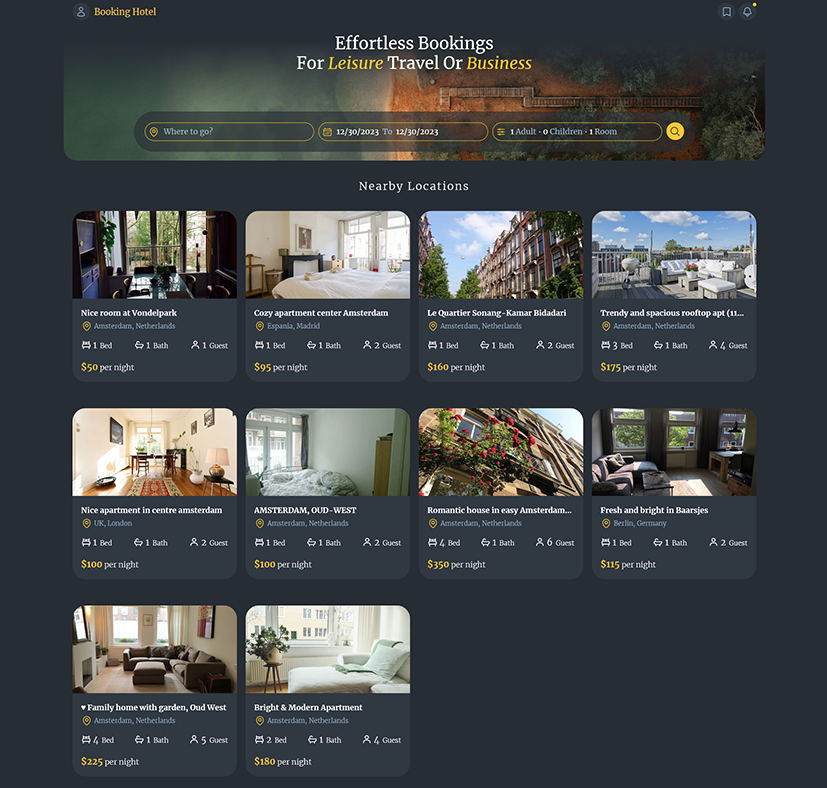

# Booking Hotel App

## Table of contents

- [Overview](#overview)
- [How to run project](#how-to-run-project)
- [Screenshot](#screenshot)
- [Built with](#built-with)
- [What I learned](#what-i-learned)

### Overview

This is a project to learn advance state management (context + reducer).
Search for hotels and see result in a list and on the map and see single hotel by clicking on a hotel item in the list.
you can add a new bookmark by clicking on the map and show and remove it in bookmark list after login by fake authentication. You can also see single bookmark.

### How to run project

- npm install
- npm run dev
- npm run server

### Screenshot



### Built with

- [React](https://reactjs.org/) - JS library
- [React-router-dom](https://reactrouter.com/en/main) - For SPA
- [tailwind](https://tailwindcss.com/) - For styles
- [react-hot-toast](https://react-hot-toast.com/) - For error handling
- [axios](https://axios-http.com/) - For fetch data
- [json-server](https://www.npmjs.com/package/json-server) - For Getting a full fake REST API
- [react-icons](https://react-icons.github.io/react-icons/) - For svg
- [react-date-range](https://www.npmjs.com/package/react-date-range) - For calendar
- [date-fns](https://www.npmjs.com/package/react-date-range) - For date operations
- [react-country-flag](https://www.npmjs.com/package/react-country-flag) - For convert countryCode to a flag
- [react-leaflet](https://react-leaflet.js.org/) - For map

### What I learned

- How to create a outsideClick custom hook
- How to setup a calendar and use it
- How to search and filter on database based on SearchParams (get and set objects in search params)
- How to locate position on map and working on map
- How to get a user's current position
- How to use context + reducer on async actions
- How to create private routes
- Fake authentication

```js
// create in context provider:
async function deleteBookmark(id) {
  dispatch({ type: "loading" });
  try {
    await axios.delete(`${BASE_URL}/${id}`);
    dispatch({ type: "bookmark/deleted", payload: id });
  } catch (error) {
    dispatch({ type: "rejected" });
    toast.error(error.message);
  }
}

// use in component:
const handleDelete = async (e, id) => {
  e.preventDefault();
  await deleteBookmark(id);
};
```
